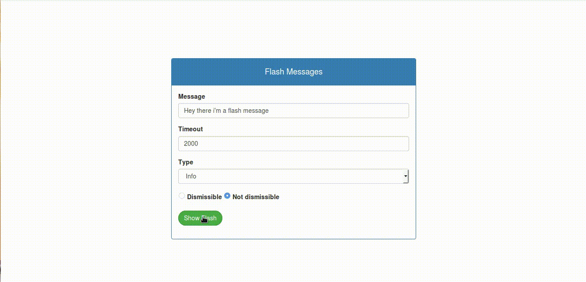

# NgFlashMessagesDemo

This is a demo project for using the ng-flash-messages library



## More on ng-flash-messages-library

You can install this this library by:

```
npm install ng-flash-messages --save
```

See the live demo on CodeSandbox:

[](https://codesandbox.io/embed/ng-flash-messages-demo-81uwb?fontsize=14&hidenavigation=1&view=preview)

(If the button does not work, use this instead: https://codesandbox.io/embed/ng-flash-messages-demo-81uwb?fontsize=14&hidenavigation=1&view=preview)

You can read more on this library here: https://www.npmjs.com/package/ng-flash-messages
